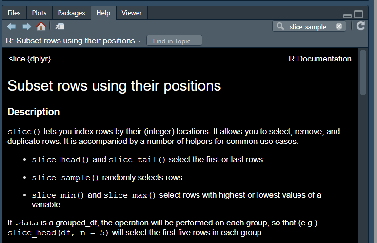

```{r set-options, echo=FALSE, cache=FALSE, message = FALSE}
knitr::opts_chunk$set(comment=NA)
options(width = 55)
```

## Today's Agenda

Working with the NHANES (`nh2`) data we built last time, focusing today on systolic and diastolic blood pressures for our sample of 1000 adults.

- How did we build that tibble again, in R?
- How should we explore these data before modeling?
  - What can we learn about the center, spread, outliers, and shape of quantitative data?
  - Are these blood pressure data well described by a Normal distribution?
- How might we start to look at Associations between our quantities?
  - Scatterplots, Correlation, Linear Models, Smoothing

## Loading our R Packages

```{r, message = FALSE}
library(NHANES)
library(janitor)
library(knitr)
library(magrittr)
library(patchwork)
library(tidyverse)

theme_set(theme_bw())
```

We'll also load another package later that I'll keep secret for now.

## Creating the `nh2` data set (from Tuesday)

This is a lot of code, and I've changed something subtle. Slower?

```{r}
set.seed(20200908) # very important to get same result later

nh2 <- NHANES %>%
    filter(SurveyYr == "2011_12") %>%
    select(ID, SurveyYr, Age, Height, Weight, BMI, Pulse,
           SleepHrsNight, BPSysAve, BPDiaAve, Gender, 
           PhysActive, SleepTrouble, Smoke100, 
           Race1, HealthGen, Depressed) %>%
    rename(SleepHours = SleepHrsNight, Sex = Gender,
           SBP = BPSysAve, DBP = BPDiaAve) %>%
    filter(Age > 20 & Age < 80) %>% 
    drop_na() %>% # removes all rows with NA
    slice_sample(., n = 1000) %>% # sample 1000 rows
    clean_names() # from the janitor package (snake case)
```

## Steps in creating the `nh2` data set (tibble)

1. Set a seed so we can get the same sample when we rerun it later. 

```
set.seed(20200908)
```

2. Start with the `NHANES` data contained in the `NHANES` package we loaded earlier.

```
nh2 <- NHANES %>%
```

At this point, we have 10,000 rows (subjects) and 76 columns (variables)

3. Restrict (filter) our subjects (rows) to those from Survey Year 2011-12

```
    filter(SurveyYr == "2011_12") %>%
```

This reduces our sample to 5,000 rows and 76 columns

## Steps in creating the `nh2` data set (tibble)

4. Select the variables we will be using in our analyses

```
    select(ID, SurveyYr, Age, Height, Weight, BMI, Pulse,
           SleepHrsNight, BPSysAve, BPDiaAve, Gender, 
           PhysActive, SleepTrouble, Smoke100, 
           Race1, HealthGen, Depressed) %>%
```

Now at 5,000 rows and 17 columns (variables)

5. Rename a few to make the names more useful

```
    rename(SleepHours = SleepHrsNight, Sex = Gender,
           SBP = BPSysAve, DBP = BPDiaAve) %>%
```

Still 5,000 rows and 17 columns, just with the new names SleepHours, Sex, SBP and DBP.

## Steps in creating the `nh2` data set (tibble)

6. Restrict our data to adults ages 21-79

```
    filter(Age > 20 & Age < 80) %>% 
```

Now down to 3,347 rows and 17 columns


7. Drop all observations with any missing values on our selected variables

```
    drop_na() %>% 
```

Now we have 2,936 rows and 17 columns with no missing data

## Steps in creating the `nh2` data set (tibble)

8. Sample a random set of 1,000 rows (without replacement)

```
    slice_sample(., n = 1000)
```

This is a newer approach to sampling than the old one I'd used in our last class. The old method has been superceded by this new approach in the tidyverse, so we'll use it going forward. 

- It yields the same sample as we generated on Tuesday, so we'll still call the eventual tibble we build `nh2`.

## How do we get help on a new function?

Try the Help window and type in the command, or just type ?(slice_sample) into the Console...



## Steps in creating the `nh2` data set (tibble)

9. Clean up the names to use "snake case"

The first few "old" names were:

- `ID`, `SurveyYr`, `Age`, `Height`, `Weight`, `BMI`, `Pulse`, `SleepHours`

The first few "new" names are:

- `id`, `survey_yr`, `age`, `height`, `weight`, `bmi`, `pulse`, `sleep_hours`

I like this change, personally. It helps me know what to expect and have to remember fewer details. 

- `clean_names` can be used to do other sorts of cleaning, too.

## All 9 steps: Creating the `nh2` data set

```{r}
set.seed(20200908) # very important to get same result later

nh2 <- NHANES %>%
    filter(SurveyYr == "2011_12") %>%
    select(ID, SurveyYr, Age, Height, Weight, BMI, Pulse,
           SleepHrsNight, BPSysAve, BPDiaAve, Gender, 
           PhysActive, SleepTrouble, Smoke100, 
           Race1, HealthGen, Depressed) %>%
    rename(SleepHours = SleepHrsNight, Sex = Gender,
           SBP = BPSysAve, DBP = BPDiaAve) %>%
    filter(Age > 20 & Age < 80) %>% 
    drop_na() %>% # removes all rows with NA
    slice_sample(., n = 1000) %>% # sample 1000 rows
    clean_names() # from the janitor package (snake case)
```

## Why do we have to set a seed?

```{r}
set.seed(431431) # change the seed to a new number

nh2_newseed <- NHANES %>%
    filter(SurveyYr == "2011_12") %>%
    select(ID, SurveyYr, Age, Height, Weight, BMI, Pulse,
           SleepHrsNight, BPSysAve, BPDiaAve, Gender, 
           PhysActive, SleepTrouble, Smoke100, 
           Race1, HealthGen, Depressed) %>%
    rename(SleepHours = SleepHrsNight, Sex = Gender,
           SBP = BPSysAve, DBP = BPDiaAve) %>%
    filter(Age > 20 & Age < 80) %>% 
    drop_na() %>% # removes all rows with NA
    slice_sample(., n = 1000) %>% # sample 1000 rows
    clean_names() # from the janitor package (snake case)
```

## Look at the data sets?

```{r}
nh2 %>% select(id, age, sbp, dbp) %>% head(3) # show first 3 

nh2_newseed %>% select(id, age, sbp, dbp) %>% head(3)
```

## Compare summaries from the data sets?

```{r}
nh2 %>% tabyl(smoke100) %>% adorn_pct_formatting()

nh2_newseed %>% tabyl(smoke100) %>% adorn_pct_formatting()
```

So maintaining the same seed is the way we get the same sample.

## Codebook for `nh2` (ID and Quantitative Variables)

Name | Description
------: | ------------------------------------------------
`id` | Identifying code for each subject
`survey_yr` | 2011_12 for all, indicates administration date
`age` | Age in years at screening of subject (must be 21-79)
`height` | Standing height in cm
`weight` | Weight in kg
`bmi` | Body mass index $(\frac{weight}{(height_{meters})^2}$ in $\frac{kg}{m^2})$
`pulse` | 60 second pulse rate
`sleep_hrs` | Self-reported hours (usually gets) per night
`sbp` | Systolic Blood Pressure (mm Hg)
`dbp` | Diastolic Blood Pressure (mm Hg)

## Codebook for `nh2` (Categorical Variables)

**Binary Variables**

Name | Levels | Description
------: | :---: | --------------------------------------------
`sex` | F, M | Sex of study subject
`phys_active` | No, Yes | Moderate or vigorous sports/recreation?
`sleep_trouble` | No, Yes | Has told a provider about trouble sleeping?
`smoke100` | No, Yes | Smoked at least 100 cigarettes in lifetime?

**Multi-Categorical Variables**

Name | Levels | Description
------: | :---: | --------------------------------------------
`race1` | 5 | Self-reported Race/Ethnicity
`health_gen` | 5 | Self-reported overall general health
`depressed` | 3 | How often subject felt depressed in last 30d

## Today's Questions

1. What is the nature of the association between systolic BP and diastolic BP in these NHANES subjects?
2. How might we explore the blood pressure data to understand it better before we address the association in question 1?

### Today's Variables

Name | Description
------: | ------------------------------------------------
`id` | Identifying code for each subject
`sbp` | Systolic Blood Pressure (mm Hg)
`dbp` | Diastolic Blood Pressure (mm Hg)

## Want to Summarize Systolic BP data? DTDP

```{r, fig.height = 4.5}
ggplot(data = nh2, aes(x = sbp)) + 
  geom_histogram(bins = 20, fill = "royalblue", col = "gold")
```

## Describing a Distribution

1. Where is the **center** of the distribution?

```{r, echo = FALSE, fig.height = 4.5}
ggplot(data = nh2, aes(x = sbp)) + 
  geom_histogram(bins = 20, fill = "royalblue", col = "gold")
```

What else might we look at to improve our response?

## Describing a Distribution

2. What is the **spread/dispersion** of the distribution?

```{r, echo = FALSE, fig.height = 4.5}
ggplot(data = nh2, aes(x = sbp)) + 
  geom_histogram(bins = 20, fill = "royalblue", col = "gold")
```

What else might we look at to improve our response?

## Describing a Distribution

3. Are there any **outliers / unusual values** we should investigate?

```{r, echo = FALSE, fig.height = 4.5}
ggplot(data = nh2, aes(x = sbp)) + 
  geom_histogram(bins = 20, fill = "royalblue", col = "gold")
```

What else might we look at to improve our response?

## Describing a Distribution

4. What is the **shape** of the distribution?

```{r, echo = FALSE, fig.height = 4.5}
ggplot(data = nh2, aes(x = sbp)) + 
  geom_histogram(bins = 20, fill = "royalblue", col = "gold")
```

- What kind of shapes should we be thinking about?

## Shape Options

```{r, echo = FALSE, fig.height = 2.5}
ggplot(data = nh2, aes(x = sbp)) + 
  geom_histogram(bins = 20, fill = "royalblue", col = "gold")
```

- Is this a unimodal distribution, with one clear peak?
- Are the data symmetric, so that if we placed an imaginary line in the center of the distribution, we'd see mirror images?
- If the data appear skewed, in which direction compared to a "Normal" distribution?
  - Right skew = a longer right tail (more clustered data on the left)

So what does a "Normal" distribution look like?

## The "Normal" or "Gaussian" distribution

First, I'll show a Normal distribution with mean 0 and standard deviation 1.

```{r, echo = FALSE, fig.height = 4.5}
ggplot(data.frame(x = c(-4, 4)), aes(x = x)) +
  stat_function(fun = dnorm)
```

All Normal distributions differ only in their mean (center) and standard deviation (spread), and thus not in terms of their shape. 

## The "Normal" or "Gaussian" distribution

Here we'll show a few examples for illustration. 

```{r, echo = FALSE, fig.height = 4.5}
p1 <- ggplot(data.frame(x = c(-4, 4)), aes(x = x)) +
  stat_function(fun = dnorm, args = list(mean = 0, sd = 1)) +
  labs(title = "Normal with mean 0, sd 1")

p2 <- ggplot(data.frame(x = c(96, 104)), aes(x = x)) +
  stat_function(fun = dnorm, args = list(mean = 100, sd = 1)) +
  labs(title = "Normal with mean 100, sd 1")

p3 <- ggplot(data.frame(x = c(-10, 10)), aes(x = x)) +
  stat_function(fun = dnorm, args = list(mean = 0, sd = 3)) +
  labs(title = "Normal with mean 0, sd 3")

p4 <- ggplot(data.frame(x = c(90, 110)), aes(x = x)) +
  stat_function(fun = dnorm, args = list(mean = 100, sd = 3)) +
  labs(title = "Normal with mean 100, sd 3")

(p1 + p2) / (p3 + p4)
```

- **Note the changes in the x axis for each distribution**.

## Simulating a "Normal" distribution of our SBP

Here's a histogram of 1000 observations I simulated from a Normal distribution with the same mean (120.5) and standard deviation (15.8) as our `nh2` sample of systolic blood pressures.

```{r, echo = FALSE, fig.height = 4.5}
set.seed(2020)
temp <- tibble(sbp_sim = rnorm(n = 1000, mean = 120.5, sd = 15.8))
ggplot(temp, aes(x = sbp_sim)) +
  geom_histogram(bins = 20, fill = "turquoise", col = "black")
```

## Does the Normal approximate our `nh2` SBPs well?

```{r, echo = FALSE, warning = FALSE}
p1 <- ggplot(data = nh2, aes(x = sbp)) + 
  geom_histogram(binwidth = 10, fill = "royalblue", col = "gold") +
  scale_x_continuous(limits = c(50, 200), breaks = c(60, 90, 120, 150, 180)) +
  labs(title = "1000 Observed SBP values from nh2 (sample mean = 120.5, sd = 15.8)")

p2 <- ggplot(temp, aes(x = sbp_sim)) +
  geom_histogram(binwidth = 10, fill = "turquoise", col = "black") +
  scale_x_continuous(limits = c(50, 200), breaks = c(60, 90, 120, 150, 180)) +
  labs(title = "1000 Simulated Values from Normal distribution with mean = 120.5, sd = 15.8")

p1 / p2
```

## Simulated Data from a Normal distribution

Here's some of the code I used to simulate and build a histogram of 1000 observations drawn from a Normal distribution with the same mean (120.5) and standard deviation (15.8) as our `nh2` sample of systolic blood pressures.

```{r, eval = FALSE}
set.seed(2020)
temp <- tibble(sbp_sim = 
                 rnorm(n = 1000, mean = 120.5, sd = 15.8))

ggplot(temp, aes(x = sbp_sim)) +
  geom_histogram(binwidth = 10, 
                 fill = "turquoise", col = "black")
```

Of course, I added a title, too, in the version on the previous slide, and did some work to make the limits and tick marks on the x axis match up across the two plots. You have the code in the R Markdown file if you want it.

## Summarizing the Systolic BP distribution

```{r, message = FALSE}
mosaic::favstats(~ sbp, data = nh2) %>% kable(digits = 1)
```

- **n** = number of non-missing values for this variable
- **missing** = number of missing values for this variable
- **Mean** = arithmetic average of the values (sum / number of values)
- **SD** = standard deviation of the values (larger SD = more spread/dispersion in the data distribution) = also equal to the square root of the variance

If the data follow an (approximately) Normal distribution, then interpreting the Mean and SD becomes much easier than if they don't. 

## If the data are Normally distributed

- then the Mean and the Median should be in the same place
- about 68% of the data will be within 1 standard deviation of the mean
- about 95% of the data will be within 2 standard deviations of the mean
- about 99.7% of the data will be within 3 standard deviations of the mean

but if the data aren't symmetric, with a bell-shaped curve, then...

- the interpretation of the mean relative to the median changes (in light of skew)
- the interpretation of a standard deviation is not as well connected to the percentages listed above

## What else can we learn about Systolic BP?

```{r, message = FALSE}
mosaic::favstats(~ sbp, data = nh2) %>% kable(digits = 1)
```

- Five Number Summary (describes five key percentiles of the data)

Minimum | Q1 = 1st Quartile | Median | Q3 = 3rd Quartile | Maximum
:------: | :------: | :------: | :------: | :------:
P0 | P25 | P50 | P75 | P100

- Several measures of spread are derived from these percentiles
  - Range = Maximum - Minimum
  - IQR = Q3 - Q1 (range of the middle half of the distribution)
- The middle three percentiles form the box in a boxplot.

## Boxplot of Systolic BP for all subjects

```{r, fig.height = 3.5}
ggplot(nh2, aes(x = "", y = sbp)) + 
  geom_boxplot() + coord_flip() +
  labs(x = "nh2 sample")
```

## Add the Violin Plot?

```{r, fig.height = 3.5}
ggplot(nh2, aes(x = "", y = sbp)) + 
  geom_violin(fill = "thistle") + 
  geom_boxplot(width = 0.3) + 
  coord_flip() + labs(x = "nh2 sample")
```

## More Extensive Numerical Summaries?

We could try

```
nh2 %>% Hmisc::describe(sbp)
```

>- but that will throw an error message, specifically `Error in describe.data.frame(., sbp) : object 'sbp' not found`. What is wrong? How can we fix that?

>- We could drop the pipe and use `$` notation, so `Hmisc::describe(nh2$sbp)`

>- Another option is to change the pipe (to the `%$%` pipe available in the `magrittr` package): `nh2 %$% Hmisc::describe(sbp)`

## What do these summaries tell us?

```{r}
nh2 %$% Hmisc::describe(sbp)
```

- `Gmd` = Gini's mean difference (a robust measure of spread) = mean absolute difference between any pairs of observations. Larger `Gmd` indicates more spread.
- `Info` = a measure of relative information describing how "continuous" the data are. Higher `Info` indicates fewer ties.

## OK, what about Diastolic Blood Pressure?

```{r, fig.height = 4.5}
ggplot(data = nh2, aes(x = dbp)) + 
  geom_histogram(bins = 20, fill = "tomato", col = "gold")
```

- Center? Spread? Outliers? Shape?

## Numerical Summary of `dbp`?

```{r}
mosaic::favstats(~ dbp, data = nh2) %>% kable(digits = 1)
```

## Hmisc::describe for `dbp`?

```{r}
nh2 %$% Hmisc::describe(dbp)
```

What is a plausible diastolic blood pressure?

## Stem-and-Leaf of `dbp` values?

```{r}
stem(nh2$dbp)
```

## Who are those people with tiny `dbp` values?

```{r}
nh2 %>%
  filter(dbp < 40) %>% 
  select(id, sbp, dbp)
```

## Let's reset.

```{r}
nh2_new <- nh2 %>%
  filter(dbp > 39)

nrow(nh2)
nrow(nh2_new)
```

We'll work with `nh2_new` for the rest of today. Now, finally, let's address the issue of the relationship between `sbp` and `dbp` in these subjects

## Scatterplot is the place to start

```{r, fig.height = 4.5}
ggplot(nh2_new, aes(x = dbp, y = sbp)) +
  geom_point() + 
  theme(aspect.ratio = 1) # make the plot square for slide
```

## Numerical Summary: Pearson Correlation

The Pearson correlation ranges from -1 to +1.

- The closer the absolute value of the correlation is to 1, the stronger a linear fit will be to the data, (in a limited sense).
- A strong positive correlation (near +1) will indicate a strong model with a positive slope.
- A strong negative correlation (near -1) will indicate a strong linear model with a negative slope.
- A weak correlation (near 0) will indicate a poor fit for a linear model, although a non-linear model may still fit the data quite well.

## Correlation in our sbp-dbp scatterplot?

```{r, fig.height = 3}
ggplot(nh2_new, aes(x = dbp, y = sbp)) +
  geom_point() + theme(aspect.ratio = 1)

nh2_new %$% cor(sbp, dbp)
```

What does a correlation of +0.42 imply about a linear fit to the data?

## Try to predict `sbp` from `dbp`?

```{r, fig.height = 4.5}
ggplot(nh2_new, aes(x = dbp, y = sbp)) + 
  geom_point() + theme(aspect.ratio = 1) +
  geom_smooth(method = "lm", formula = y ~ x, 
              col = "red", se = TRUE)
```

## What line is being fit there?

Least Squares Regression Line (a linear model) to predict `sbp` using `dbp`

```{r}
m1 <- lm(sbp ~ dbp, data = nh2_new)
m1
```

Model is **sbp = 76.13 + 0.62 dbp**. What do the slope and intercept mean?

## Linear Model `m1`: sbp = 76.13 + 0.62 dbp

76.13 is the intercept = predicted value of `sbp` when `dbp` = 0.

- Is that reasonable in this setting?

0.62 is the slope = predicted change in `sbp` per 1 unit change in `dbp`

- What are the units here?
- What does the fact that this estimated slope is positive mean?
- What would the line look like if the slope was negative? What if the slope was zero?

## Is this the only linear model R can fit to these data?

Nope.

```{r}
library(rstanarm)
```

## Fit linear model using `stan_glm`?

```{r}
m2 <- stan_glm(sbp ~ dbp, data = nh2_new)
```

## Bayesian fitted linear model for our sbp data

```{r}
print(m2)
```

## Is the Bayesian model very different from our `lm` in this situation?

```{r}
coef(m1)

coef(m2)
```

## Does R like this linear model?

```{r}
summary(m1)$coefficients
```

Yes. Wow. It **really** does. Look at those *p* values (listed as Pr(>|t|)!

`2.34e-44` is just scientific notation: $2.34 x 10^{-44}$. 

- I'll note that this is many orders of magnitude smaller than what we can usually deal with without rounding issues. 
- R often reports (effectively) zero values with `2.2e-16`.

## How is the r-squared ($r^2$)?

```{r}
summary(m1)$r.squared
```

- This R-squared value says something about the proportion of the variation in our `sbp` that can be accounted for by the linear model we've built using `dbp`. 
- About 18% in this case. Is that good?
- Why is this called R-squared? What is the R?

```{r}
nh2_new %$% cor(sbp, dbp)
```

```{r}
nh2_new %$% cor(sbp, dbp)^2
```

## But is a linear model really the right choice?

```{r, fig.height = 4.5}
ggplot(nh2_new, aes(x = dbp, y = sbp)) + 
  geom_point() + theme(aspect.ratio = 1) +
  geom_smooth(method = "loess", formula = y ~ x, 
              col = "blue", se = TRUE)
```

Hmmm...

