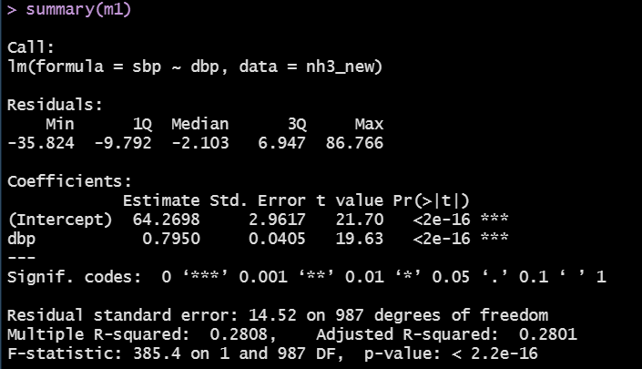

```{r set-options, echo=FALSE, cache=FALSE, message = FALSE}
knitr::opts_chunk$set(comment=NA)
options(width = 55)
```

## Today's R Packages

```{r, message = FALSE}
library(NHANES)
library(janitor)
library(knitr)
library(broom)
library(magrittr)
library(patchwork)
library(rstanarm)
library(tidyverse)

theme_set(theme_bw())
```


## Our `nh3_new` data (n = 989, 17 variables)

```{r}
set.seed(20200914) 

nh3_new <- NHANES %>%
    filter(SurveyYr == "2011_12") %>%
    select(ID, SurveyYr, Age, Height, Weight, BMI, Pulse,
           SleepHrsNight, BPSysAve, BPDiaAve, Gender, 
           PhysActive, SleepTrouble, Smoke100, 
           Race1, HealthGen, Depressed) %>%
    rename(SleepHours = SleepHrsNight, Sex = Gender,
           SBP = BPSysAve, DBP = BPDiaAve) %>%
    filter(Age > 20 & Age < 80) %>%
    drop_na() %>%
    distinct() %>%
    slice_sample(n = 1000) %>%
    clean_names() %>%
    filter(dbp > 39)
```

## Correlation in our sbp-dbp scatterplot?

```{r, echo = FALSE, fig.height = 3}
ggplot(nh3_new, aes(x = dbp, y = sbp)) + 
  geom_point(alpha = 0.3) + theme(aspect.ratio = 1) + # make plot square
  geom_smooth(method = "lm", formula = y ~ x, col = "red")
```

```{r}
nh3_new %$% cor(sbp, dbp)
```

What does a correlation of +0.53 imply about a linear fit to the data?

## What line is being fit?

Least Squares Regression Line (a linear model) to predict `sbp` using `dbp`

```{r}
m1 <- lm(sbp ~ dbp, data = nh3_new)
m1
```

Model m1 is **sbp = 64.270 + 0.795 dbp**. 

## Linear Model `m1`: sbp = 64.27 + 0.795 dbp

64.27 is the intercept = predicted value of `sbp` when `dbp` = 0.

0.795 is the slope = predicted change in `sbp` per 1 unit change in `dbp`

- What are the units?
- What does the fact that this estimated slope is positive mean?
- What would the line look like if the slope was negative? 
- What if the slope was zero?

## Summarizing the Fit

The `summary` function when applied to a linear model (`lm`) produces a lot of output that is not organized in a way that we can plot/manipulate it well.

Here's the start of what it looks like... (complete snapshot on next slide)

```{r}
summary(m1)
```

## `summary(m1)` in its entirety



## Why I like `tidy()` and other `broom` functions


https://github.com/allisonhorst/stats-illustrations

## Does R like this linear model?

```{r}
tidy(m1) %>% kable(digits = 2)
```

Yes. Wow. It **really** does. Look at those *p* values!

## How much of the variation in `sbp` does m1 capture?

The `glance` function can help us (again from `broom`.) 

```{r}
glance(m1) %>% select(r.squared, p.value, sigma) %>% kable()
```

- `r.squared` = $R^2$, the proportion of variation in `sbp` accounted for by the model using `dbp`. 
  - indicates improvement over predicting mean(`sbp`) for everyone
- `p.value` = refers to a global F test 
  - indicates something about combination of $r^2$ and sample size
- `sigma` = residual standard error 

`glance` provides 9 additional summaries for a linear model.

## How is the r-squared ($r^2$)?

R-squared describes the proportion of the variation in `sbp` accounted for by the linear model `m1` using `dbp`. 

- $R^2$ is about 28% (or 0.28) in this case. Is that good?
- Why is this called R-squared? What is the R?

```{r}
nh3_new %$% cor(sbp, dbp)
```

```{r}
nh3_new %$% cor(sbp, dbp)^2
```

## Can you guess the missing R-squares?

```{r, echo = FALSE}
set.seed(4312020)

correxs <- tibble(x = seq(10.5,110, by = 0.5),
                  y1 = -0.01*x + rpois(200, lambda = 14),
                  y2 = 0.023*x + rpois(200, lambda = 16),
                  y3 = -0.049*x + rpois(200, lambda = 20),
                  y4 = 0.0504*x + rpois(200, lambda = 20),
                  y5 = -0.085*x + rpois(200, lambda = 18),
                  y6 = -0.095*x + rpois(200, lambda = 19),
                  y7 = 0.15*x + rpois(200, lambda = 20),
                  y8 = -0.185*x + rpois(200, lambda = 20),
                  y0 = rpois(200, lambda = 16),
                  y9 = 0.315*x + rpois(200, lambda = 19),
                  y10 = -0.435*x + rpois(200, lambda = 16),
                  y11 = 1.01*x + rpois(200, lambda = 17))
```

```{r, echo = FALSE}
p4a <- ggplot(correxs, aes(x = x, y = y4)) + 
  geom_point(col = "blue", pch = 1) + 
  geom_smooth(method = "lm", col = "red", formula = "y ~ x", se = FALSE) + 
  theme(aspect.ratio = 1) +
  labs(title = "C. R-square = ?", y = "", x = "")

p5a <- ggplot(correxs, aes(x = x, y = y5)) + 
  geom_point(col = "blue", pch = 1) + 
  geom_smooth(method = "lm", col = "red", formula = "y ~ x", se = FALSE) + 
  theme(aspect.ratio = 1) +
  labs(title = "E. R-square = ?", y = "", x = "")

p7a <- ggplot(correxs, aes(x = x, y = y7)) + 
  geom_point(col = "blue", pch = 1) + 
  geom_smooth(method = "lm", col = "red", formula = "y ~ x", se = FALSE) + 
  theme(aspect.ratio = 1) +
  labs(title = "D. R-square = ?", y = "", x = "")

p8a <- ggplot(correxs, aes(x = x, y = y8)) + 
  geom_point(col = "blue", pch = 1) + 
  geom_smooth(method = "lm", col = "red", formula = "y ~ x", se = FALSE) + 
  theme(aspect.ratio = 1) +
  labs(title = "B. R-square = ?", y = "", x = "")

p9a <- ggplot(correxs, aes(x = x, y = y9)) + 
  geom_point(col = "blue", pch = 1) + 
  geom_smooth(method = "lm", col = "red", formula = "y ~ x", se = FALSE) + 
  theme(aspect.ratio = 1) +
  labs(title = "A. R-square = ?", y = "", x = "")

p10a <- ggplot(correxs, aes(x = x, y = y10)) + 
  geom_point(col = "blue", pch = 1) + 
  geom_smooth(method = "lm", col = "red", formula = "y ~ x", se = FALSE) + 
  theme(aspect.ratio = 1) +
  labs(title = "R-sq = 0.905", y = "", x = "")

```

```{r, echo = FALSE}
(p9a + p8a + p4a) / (p7a + p5a + p10a)
```

## Gaining Insight into what R-square implies

```{r, echo = FALSE}
p4b <- ggplot(correxs, aes(x = x, y = y4)) + 
  geom_point(col = "blue", pch = 1) + 
  geom_smooth(method = "lm", col = "red", formula = "y ~ x", se = FALSE) + 
  theme(aspect.ratio = 1) +
  labs(title = "r = +0.4, R-sq = 0.16", y = "", x = "")

p5b <- ggplot(correxs, aes(x = x, y = y5)) + 
  geom_point(col = "blue", pch = 1) + 
  geom_smooth(method = "lm", col = "red", formula = "y ~ x", se = FALSE) + 
  theme(aspect.ratio = 1) +
  labs(title = "r = -0.5, R-sq = 0.25", y = "", x = "")

p7b <- ggplot(correxs, aes(x = x, y = y7)) + 
  geom_point(col = "blue", pch = 1) + 
  geom_smooth(method = "lm", col = "red", formula = "y ~ x", se = FALSE) + 
  theme(aspect.ratio = 1) +
  labs(title = "r = +0.7, R-sq = 0.49", y = "", x = "")

p8b <- ggplot(correxs, aes(x = x, y = y8)) + 
  geom_point(col = "blue", pch = 1) + 
  geom_smooth(method = "lm", col = "red", formula = "y ~ x", se = FALSE) + 
  theme(aspect.ratio = 1) +
  labs(title = "r = -0.8, R-sq = 0.64", y = "", x = "")

p9b <- ggplot(correxs, aes(x = x, y = y9)) + 
  geom_point(col = "blue", pch = 1) + 
  geom_smooth(method = "lm", col = "red", formula = "y ~ x", se = FALSE) + 
  theme(aspect.ratio = 1) +
  labs(title = "r = +0.9, R-sq = 0.81", y = "", x = "")

p10b <- ggplot(correxs, aes(x = x, y = y10)) + 
  geom_point(col = "blue", pch = 1) + 
  geom_smooth(method = "lm", col = "red", formula = "y ~ x", se = FALSE) + 
  theme(aspect.ratio = 1) +
  labs(title = "r = -0.95, R-sq = 0.905", y = "", x = "")

```

```{r, echo = FALSE}
(p9b + p8b + p4b) / (p7b + p5b + p10b)
```


## Predict using `m1`: `sbp` = 64.27 + 0.795 `dbp`

Use `augment` (also from `broom`) to capture results.

```{r}
m1_insample <- augment(m1, data = nh3_new)

m1_insample %>% select(id, sbp, dbp, .fitted, .resid) %>% 
  head(2) %>% kable(digits = 2)
```

For subject 69036, as an example, we have:

- `m1`'s fitted `sbp` = 64.27 + 0.795 (44) = 99.25 mm Hg
- **residual** = observed - fitted = 136 - 99.25 = 36.75 mm Hg

## Plot residuals from `m1` in our sample (n = 989)

```{r, echo = FALSE, message = FALSE}
p1 <- ggplot(m1_insample, aes(sample = .resid)) +
  geom_qq(col = "tomato") + geom_qq_line(col = "black") + 
  theme(aspect.ratio = 1) + 
  labs(title = "Normal Q-Q: 989 m1 Residuals")

p2 <- ggplot(m1_insample, aes(x = .resid)) +
  geom_histogram(aes(y = stat(density)), 
                 bins = 20, fill = "tomato", col = "yellow") +
  stat_function(fun = dnorm, 
                args = list(mean = mean(m1_insample$.resid), 
                            sd = sd(m1_insample$.resid)),
                col = "black", lwd = 1.5) +
  labs(title = "Hist + Normal Density: m1 Residuals")

p3 <- ggplot(m1_insample, aes(x = .resid, y = "")) +
  geom_boxplot(fill = "tomato", outlier.color = "tomato") + 
  labs(title = "Boxplot: m1 Residuals", y = "")

p1 + (p2 / p3 + plot_layout(heights = c(4,1)))

mosaic::favstats(~ .resid, data = m1_insample) %>% kable(digits = 1)
```

## Plot Residuals vs. Predicted (Fitted) Values

```{r, echo = FALSE}
ggplot(m1_insample, aes(x = .fitted, y = .resid)) +
  geom_point() +
  geom_smooth(method = "lm", formula = y ~ x, se = FALSE, col = "red") + 
  geom_smooth(method = "loess", formula = y ~ x, se = FALSE, col = "blue") +
  labs(title = "Residual Plot for m1 in nh3_new (n = 989)", 
       x = "Fitted sbp values", y = "Residuals")
```

## Who else could we make predictions for with `m1`?

Consider NHANES subjects who we didn't choose for the `nh3` sample?

```{r}
nh_deduplicated <- NHANES %>%
    filter(SurveyYr == "2011_12") %>%
    select(ID, SurveyYr, Age, Height, Weight, BMI, Pulse,
           SleepHrsNight, BPSysAve, BPDiaAve, Gender, 
           PhysActive, SleepTrouble, Smoke100, 
           Race1, HealthGen, Depressed) %>%
    rename(SleepHours = SleepHrsNight, Sex = Gender,
           SBP = BPSysAve, DBP = BPDiaAve) %>%
    filter(Age > 20 & Age < 80) %>% 
    drop_na() %>%
    distinct() 
```

This `nh_deduplicated` group is who we sampled from to get `nh3`.

## Identifying those not sampled, but still eligible.

We sampled 1000 observations from a group, and then dropped those with `dbp` below 40, leaving n = 989. How many people in total would be eligible?

```{r}
nh3_new_eligible <- nh_deduplicated %>%
  clean_names() %>%
  filter(dbp > 39) 

dim(nh3_new_eligible)
dim(nh3_new)
```

## Identify the rest: 1709-989 = 720 not sampled

```{r}
nh3_therest <- 
  anti_join(nh3_new_eligible, nh3_new, by = "id")

dim(nh3_therest)
```

## Use model `m1` to predict SBP in `nh3_therest`?

```{r}
new720_nh3 <- augment(m1, newdata = nh3_therest)

new720_nh3 %>% select(id, sbp, dbp, .fitted, .resid) %>% 
  head() %>% kable(digits = 2)
```

## Actual SBP vs. Fitted SBP by `m1` (n = 720)

```{r, fig.height = 4.5}
ggplot(new720_nh3, aes(x = .fitted, y = sbp)) +
  geom_abline(slope = 1, intercept = 0, col = "red") +
  geom_point() + theme(aspect.ratio = 1) 
```

## New Sample (n = 720): `m1` Prediction Errors

```{r, echo = FALSE}
p1 <- ggplot(new720_nh3, aes(sample = .resid)) +
  geom_qq(col = "darkorchid") + geom_qq_line(col = "black") + 
  theme(aspect.ratio = 1) + 
  labs(title = "Normal Q-Q: 720 m1 Errors")

p2 <- ggplot(new720_nh3, aes(x = .resid)) +
  geom_histogram(aes(y = stat(density)), 
                 bins = 20, fill = "darkorchid", col = "green") +
  stat_function(fun = dnorm, 
                args = list(mean = mean(new720_nh3$.resid), 
                            sd = sd(new720_nh3$.resid)),
                col = "black", lwd = 1.5) +
  labs(title = "Hist + Normal Density: 720 m1 Errors")

p3 <- ggplot(new720_nh3, aes(x = .resid, y = "")) +
  geom_boxplot(fill = "darkorchid", outlier.color = "darkorchid") + 
  labs(title = "Boxplot: 720 m1 Errors", y = "")

p1 + (p2 / p3 + plot_layout(heights = c(4,1)))

mosaic::favstats(~ .resid, data = new720_nh3) %>% kable(digits = 1)
```

## Prediction Errors vs. Fitted SBP (n = 720)

```{r, fig.height = 4.5}
ggplot(new720_nh3, aes(x = .fitted, y = .resid)) +
  geom_point() + theme(aspect.ratio = 1) +
  geom_smooth(method = "lm", formula = y ~ x, se = FALSE)
```

## Back to `sbp` and `dbp`. Does `m1` work well here?

```{r, fig.height = 4.5}
ggplot(nh3_new, aes(x = dbp, y = sbp)) + 
  geom_point() + theme(aspect.ratio = 1) +
  geom_smooth(method = "lm", formula = y ~ x, 
              col = "red", se = TRUE)
```

## Is this the only linear model R can fit to these data?

Nope.

## Fit linear model using `stan_glm`?

```{r}
## this is why we ran library(rstanarm)

m2 <- stan_glm(sbp ~ dbp, data = nh3_new)
```

## Bayesian fitted linear model for our sbp data

```{r}
print(m2)
```

## Is the Bayesian model (with default prior) very different from our `lm` in this situation?

```{r}
coef(m1) # fit with lm

coef(m2) # stan_glm with default priors
```

Note that we could use `tidy` and other `broom` functions for the `lm` model but not (yet) for the `stan_glm` model.

## Again, consider `sbp` and `dbp`. Does `m1` work well?

```{r, fig.height = 4.5}
ggplot(nh3_new, aes(x = dbp, y = sbp)) + 
  geom_point() + theme(aspect.ratio = 1) +
  geom_smooth(method = "loess", formula = y ~ x, 
              col = "blue", se = TRUE)
```


