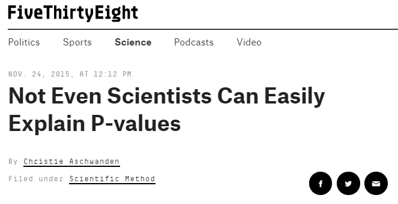
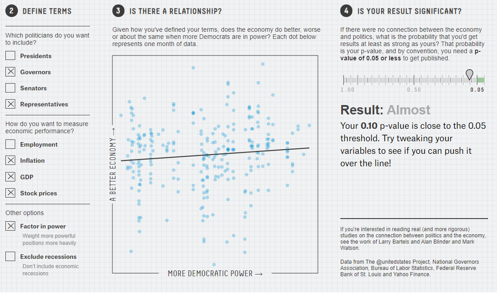

```{r set-options, echo=FALSE, cache=FALSE, message = FALSE}
knitr::opts_chunk$set(comment=NA)
options(width = 55)
```

## Today's Agenda

- Alternate Strategies for Building Confidence Intervals for the Population Mean
  - Resampling and the Bootstrap
  - Wilcoxon Signed Rank approaches
- p values and Researcher Degrees of Freedom

## Today's R Packages and Data

```{r, message = FALSE}
library(broom)
library(janitor)
library(knitr)
library(magrittr)
library(patchwork)
library(tidyverse)

theme_set(theme_bw())

dm431 <- readRDS("data/dm431_2020.Rds")
```

# What is a p value?

## From FiveThirtyEight

> P-values have taken quite a beating lately. These widely used and commonly misapplied statistics have been blamed for giving a veneer of legitimacy to dodgy study results, encouraging bad research practices and promoting false-positive study results.

> Last week, I attended the inaugural METRICS conference at Stanford, which brought together some of the world's leading experts on meta-science, or the study of studies. I figured that if anyone could explain p-values in plain English, these folks could. 

(Christie Aschwanden, [FiveThirtyEight](https://fivethirtyeight.com/features/not-even-scientists-can-easily-explain-p-values/), 2015-11-24)

## Let's Go To The Videotape



Link: https://fivethirtyeight.com/features/not-even-scientists-can-easily-explain-p-values/

## Do Scientists Get This Right?

> Scientists regularly get it wrong, and so do most textbooks, said Steven Goodman (co-director of the METRICS conference.) Even after spending his "entire career" thinking about p-values, he said he could tell me the definition, "but I cannot tell you what it means, and almost nobody can."

> When Goodman speaks to large audiences of scientists, he often presents correct and incorrect definitions of the p-value, and they "very confidently" raise their hand for the wrong answer. "Almost all of them think it gives some direct information about how likely they are to be wrong, and that's definitely not what a p-value does," Goodman said.

(Christie Aschwanden, [FiveThirtyEight](https://fivethirtyeight.com/features/not-even-scientists-can-easily-explain-p-values/), 2015-11-24)

## Can we define a p value better?

> I've come to think that the most fundamental problem with p-values is that no one can really say what they are.

> What I learned by asking all these very smart people to explain p-values is that I was on a fool's errand. Try to distill the p-value down to an intuitive concept and it loses all its nuances and complexity, said science journalist Regina Nuzzo, a statistics professor at Gallaudet University. "Then people get it wrong, and this is why statisticians are upset and scientists are confused." 

> You can get it right, or you can make it intuitive, but it's all but impossible to do both.

(Christie Aschwanden, [FiveThirtyEight](https://fivethirtyeight.com/features/not-even-scientists-can-easily-explain-p-values/), 2015-11-24)

## Last time, we built a 90% CI for $\mu$ = population mean SBP...

Use indicator variable regression to produce a t-based interval.

```{r}
model1 <- lm(sbp ~ 1, data = dm431)

tidy(model1, conf.int = TRUE, conf.level = 0.90) %>%
  select(term, estimate, std.error, 
         conf.low, conf.high, p.value) %>%
  knitr::kable(digits = 2)
```

```{r, echo = FALSE}
res <- tidy(model1, conf.int = TRUE, conf.level = 0.90)
```

- Our point estimate for the population mean SBP ($\mu$) is `r round_half_up(res$estimate,2)` mm Hg.
- Our 90% confidence interval is (`r round_half_up(res$conf.low, 2)`, `r round_half_up(res$conf.high, 2)`) mm Hg for $\mu$.

## Assumptions of a t-based Confidence Interval

> "Begin challenging your assumptions. Your assumptions are your windows on the world. Scrub them off every once in awhile or the light won't come in." (Alan Alda)

1. Sample is drawn at random from the population or process.
2. Samples are drawn independently from each other from a population or process whose distribution is unchanged during the sampling process.
3. Population or process follows a Normal distribution.

### Can we drop any of these assumptions?

Only if we're willing to consider alternative inference methods.

# Confidence Intervals using Bootstrap Resampling

## Resampling is A Big Idea

If we want our sample mean to accurately estimate the population mean, we would ideally like to take a very, very large sample, so as to get very precise estimates. But we can rarely draw enormous samples. So what can we do?  

Oversimplifying, the idea is that if we sample (with replacement) from our current data, we can draw a new sample of the same size as our original. 

- And if we repeat this many times, we can generate as many samples of "431 systolic blood pressures" as we like. 
- Then we take these thousands of samples and calculate (for instance) the sample mean for each, and plot a histogram of those means. 
- If we then cut off the top and bottom 5% of these sample means, we obtain a reasonable 90% confidence interval for the population mean. 

## Bootstrap 90% confidence interval

The bootstrap can be used to build a confidence interval for $\mu$ without the assumption that the population follows a Normal distribution. 

```{r}
set.seed(2020)
Hmisc::smean.cl.boot(dm431$sbp, conf.int = .90, B = 1000)
```

- I often use B = 1,000 (the default) or 10,000 bootstrap replications for building CIs, but it isn't usually critical.
- A bootstrap interval is often asymmetric, and for highly skewed data, the point estimate might not be near the center of the interval.

## One "Downside" of the Bootstrap

We get (somewhat) different answers if we resample the data with a new seed.

```{r}
set.seed(2020); Hmisc::smean.cl.boot(dm431$sbp, conf.int = .9)

set.seed(12); Hmisc::smean.cl.boot(dm431$sbp, conf.int = .90)

set.seed(431); Hmisc::smean.cl.boot(dm431$sbp, conf.int = .9)
```

What changes when we set the seed?


## Bootstrap vs. t-Based Confidence Intervals

- `Hmisc`'s `smean.cl.boot` function (unlike most R functions) deletes missing data automatically, as does the `smean.cl.normal` function, which produces the t-based confidence interval.

```{r}
set.seed(431)
dm431 %$% Hmisc::smean.cl.boot(sbp, conf = 0.90)
dm431 %$% Hmisc::smean.cl.normal(sbp, conf = 0.90)
```

## Bootstrap: Estimating a confidence interval for $\mu$

What the computer does:

1. Resample the data with replacement, until it obtains a new sample that is equal in size to the original data set. 
2. Calculates the statistic of interest (here, a sample mean.) 
3. Repeat the steps above many times (default is 1,000 with our approach) to obtain a set of 1,000 results (here: 1,000 sample means.) 
4. Sort those 1,000 results in order, and estimate the 90% confidence interval for the population value based on the middle 90% of the 1,000 bootstrap samples.
5. Send us a result, containing the sample estimate, and the bootstrap 90% confidence interval estimate for the population value.

The bootstrap idea can be used to produce interval estimates for almost any population parameter, not just the mean.


## What about p values?

```{r}
dm431 %$% Hmisc::smean.cl.normal(sbp, conf = 0.90)
set.seed(431); dm431 %$% Hmisc::smean.cl.boot(sbp, conf = 0.9)
```

1. What can we say about the *p* value for $H_0: \mu = 0$ vs. $H_A: \mu \neq 0$ based on this bootstrap? How about based on the t-distribution CI?

2. What can we say about the *p* value for $H_0: \mu = 130$ vs. $H_A: \mu \neq 130$ based on the bootstrap? How about based on the t-distribution CI?

## When is a Bootstrap CI for $\mu$ Reasonable?

The interval will be reasonable as long as we are willing to believe that:

- the original sample was a random sample (or at least a completely representative sample) from a population, 
- and that the samples are independent of each other (selecting one subject doesn't change the probability that another subject will also be selected)
- and that the samples are identically distributed (even though that distribution may not be Normal.) 

It is still possible that the results can be both:

- **inaccurate** (i.e. they can, include the true value of the unknown population mean less often than the stated confidence probability) and 
- **imprecise** (i.e., they can include more extraneous values of the unknown population mean than is desirable).

# The Wilcoxon Signed Rank Approach (if the data come from a symmetric population)

## The Wilcoxon Signed Rank Procedure for CIs

The Wilcoxon signed rank approach can be used as an alternative to build interval estimates for the population *pseudo-median* when the population cannot be assumed to follow a Normal distribution. 

### What is a Pseudo-Median?

- For any sample, the pseudomedian is defined as the median of all of the midpoints of pairs of observations in the sample. 

- As it turns out, if you're willing to assume the population is **symmetric** (but not necessarily Normally distributed) then the pseudo-median is equal to the population median.

## Wilcoxon based 90% confidence interval

```{r}
wilcox.test(dm431$sbp, conf.int = TRUE, conf.level = 0.90)
```

## Interpreting the Wilcoxon Signed Rank CI

If we're willing to believe the `sbp` values come from a population with a symmetric distribution, the 90% Confidence Interval for the population median would be (`r round(wilcox.test(dm431$sbp, conf.int=TRUE, conf.level=0.9)$conf.int,1)`)

For a non-symmetric population, this only applies to the *pseudo-median*.

Note that the pseudo-median is actually fairly close in this situation to the sample mean as well as to the sample median, as it usually will be if the population actually follows a symmetric distribution, as the Wilcoxon approach assumes.

```{r, message = FALSE}
mosaic::favstats(~ sbp, data = dm431)
```

## Tidying the Wilcoxon Results

```{r}
w1 <- dm431 %$% 
  wilcox.test(sbp, conf.int=TRUE, conf.level=0.90)

tidy(w1) %>% select(method, alternative) %>% kable()

tidy(w1) %>% select(estimate, conf.low, conf.high, p.value) %>% kable()
```

## Three Methods for Estimating a Single Population Mean

For estimating the population mean...

1. A **t-based** estimate and confidence interval, available from an intercept-only linear model, or (equivalently) from a t test.
    - This approach will require an assumption that the population comes from a Normal distribution.
2. A **bootstrap** confidence interval, which uses resampling to estimate the population mean.
    - This approach won't require the Normality assumption, but has some other constraints.
3. A **Wilcoxon signed rank** approach, but that won't describe the mean, only a pseudo-median.
    - This also doesn't require the Normality assumption, but no longer describes the population mean (or median) unless the population can be assumed symmetric. Instead it describes the *pseudo-median*.

## Conclusions in our study of SBP in `dm431`

`dm431` sample mean was `r round_half_up(mean(dm431$sbp), 2)`, and sample median was `r median(dm431$sbp)`.

Approach | $H_A: \mu \neq 0$ | 90% CI for $\mu$
-------  | -----: | --------------------:
t-test | p < 0.0001 | (129.79, 132.74)
bootstrap | p < 0.10 | (129.80, 132.73)

Approach | $H_A: psmed \neq 0$ | 90% CI for *psmed*
-------  | -----: | --------------------:
Wilcoxon signed rank | p < 0.0001 | (129, 131.5)

- *psmed* = population pseudo-median
- Bootstrap with `set.seed = 431`

# p Hacking and "Researcher Degrees of Freedom"

## p values?

**Question 1**. If the *p* value is smaller than our pre-specified $\alpha$ level, then we can declare the results to be statistically significant and celebrate?

Well, no.


**Question 2**. What if the *p* value is greater than our $\alpha$, say *p > 0.05*? Then what?

---


## What is a *p* value?

> The probability of getting results at least as extreme as the ones you observed, given that the null hypothesis is correct.

It's a conditional probability statement. That's all.

> We want to know if results are right, but a p-value doesn't measure that. It can't tell you the magnitude of an effect, the strength of the evidence or the probability that the finding was the result of chance.

Quotes from Christie Aschwanden "[Not Even Scientists Can Easily Explain P-values](https://fivethirtyeight.com/features/not-even-scientists-can-easily-explain-p-values/)", at FiveThirtyEight.com on 2015-11-24

## Hack Your Way To Scientific Glory

https://fivethirtyeight.com/features/science-isnt-broken


## What will you be doing?



## We'll give you a few minutes.

Again, the link is https://fivethirtyeight.com/features/science-isnt-broken

1. Choose a party to frame your argument (Democrats or Republicans)
2. Define your terms (as a group) in the way you feel is most interesting. What is the resulting *p* value and conclusion?
3. Switch things up by defining new terms, switching parties or whatever you like. 
  - Can you obtain a *p* value that supports the notion that your party has a positive effect on the economy?
  - Can you obtain a *p* value that supports the notion that your party has a negative effect on the economy?
4. What is the range (minimum to maximum) of *p* values you obtained?

Go!

# So, what happened?


## What can you get?

In just a few minutes, I was able to get 

- *p* < 0.01 (*positive* effect of Democrats on economy)
- *p* < 0.01 (*negative* effect of Democrats on economy)
- *p* = 0.02 (positive effect of Democrats)
- *p* = 0.02 (negative effect of Democrats)

but also ...

- *p* = 0.06, 0.11, 0.21, 0.39, 0.47, 0.54, 0.65, 0.78 and even p > 0.99

without even switching parties (I chose to frame this in terms of the Democrats), just by checking different boxes to define my terms (section 2 of the graphic.)

## "Researcher Degrees of Freedom", 1

> [I]t is unacceptably easy to publish "statistically significant" evidence consistent with any hypothesis.

> The culprit is a construct we refer to as **researcher degrees of freedom**. In the course of collecting and analyzing data, researchers have many decisions to make: Should more data be collected? Should some observations be excluded? Which conditions should be combined and which ones compared? Which control variables should be considered? Should specific measures be combined or transformed or both?

Simmons et al. [$\textcolor{blue}{link}$](http://journals.sagepub.com/doi/abs/10.1177/0956797611417632) 

## "Researcher Degrees of Freedom", 2

> ... It is rare, and sometimes impractical, for researchers to make all these decisions beforehand. Rather, it is common (and accepted practice) for researchers to explore various analytic alternatives, to search for a combination that yields statistical significance, and to then report only what worked. The problem, of course, is that the likelihood of at least one (of many) analyses producing a falsely positive finding at the 5% level is necessarily greater than 5%.

For more, see 

- Gelman's blog [$\textcolor{blue}{2012-11-01}$](http://andrewgelman.com/2012/11/01/researcher-degrees-of-freedom/) "Researcher Degrees of Freedom", 
- Paper by [$\textcolor{blue}{Simmons}$](http://journals.sagepub.com/doi/abs/10.1177/0956797611417632) and others, defining the term.


